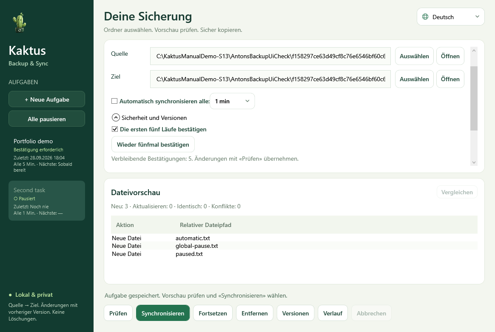

# Kaktus Backup & Sync 5.2

[Deutsch](README.md) · [English](docs/README.en.md) · [Русский](docs/README.ru.md)

**Windows x64 · Portable ZIP · .NET-Laufzeit enthalten**

- [Releases und SHA-256-Prüfsummen](https://github.com/popovantondev/Kaktus-Backup-Sync/releases)
- [Anleitung](docs/HANDBUCH.de.md) · [Rückmeldung](https://github.com/popovantondev/Kaktus-Backup-Sync/issues)

Windows-Vorabversion für einseitige Ordnersicherung: Vorschau, frühere Versionen,
automatische Aufgaben und Bedienung im Infobereich. Deutsch ist die Standardsprache.

Die portable ZIP vollständig entpacken und `KaktusBackupSync.exe` öffnen.
Die .NET-Laufzeit ist enthalten; Python, SDK und Installation sind nicht nötig.
Aufgaben, Sprache und Verlauf liegen im Unterordner `runtime`.
[Portable Kurzanleitung](docs/START-HERE.txt).



Prüfe nach dem Download die SHA-256-Prüfsumme, die beim Release angegeben ist.
Entpacke das vollständige ZIP-Archiv; die
Anwendung benötigt keine separate Installation.

1. Eine Aufgabe benennen und vorhandene Quelle und Ziel wählen.
2. **Prüfen** speichert die Aufgabe und zeigt den Plan.
3. **Synchronisieren** führt den bestätigten Plan aus.
4. Optional automatische Prüfungen alle 1, 5, 15, 30 oder 60 Minuten aktivieren.

Neue Aufgaben verlangen fünf erfolgreiche manuelle Bestätigungen. Der Schutz lässt
sich unter **Sicherheit und Versionen** ändern. Einzelne oder alle Aufgaben können
pausiert werden. Schließen verbirgt das Fenster; beendet wird über das Symbolmenü.

Quelle → Ziel, keine Rückkopie, keine automatische Löschung von Arbeitsdateien.
Aktualisierungen sichern frühere Versionen im Ziel; standardmäßig bleiben sieben
Versionen je Datei. Konfiguration, Verlauf, OneDrive-Metadaten und gebundene
Wechseldatenträger werden unterstützt.

## Benutzerhandbücher

- [Deutsches Benutzerhandbuch](docs/HANDBUCH.de.md)
- [English quick guide](docs/README.en.md)
- [Русское краткое руководство](docs/README.ru.md)
- [Portable-Kurzanleitung](docs/START-HERE.txt)
- [Changelog](CHANGELOG.md)

## Entwicklung und Wartungsunterlagen

- [Architektur in drei Sprachen](docs/ARCHITECTURE.md)
- [Hinweise zum Quelltextpaket](docs/SOURCE-PACKAGE.md)
- [Historischer lokaler Release-Audit](docs/RELEASE_AUDIT.md)
- [Сверка требований](docs/REQUIREMENTS_STATUS.ru.md)
- [Карта проекта и опубликованных локальных выпусков](docs/PROJECT_MAP.ru.md)

## Datenschutz

Die Anwendung verarbeitet die ausgewählten Ordner lokal und lädt keine Dateien
hoch. Aufgaben und Verlauf werden im lokalen `runtime`-Ordner gespeichert.
Screenshots und Fehlerberichte können persönliche Pfade oder Dateinamen zeigen;
entferne diese Angaben vor dem Teilen.

## Rechte

Der Quelltext ist öffentlich einsehbar, aber nicht Open Source. Eine
unveränderte Programmversion darf für den persönlichen Gebrauch heruntergeladen
und ausgeführt werden. [Rechte und Nutzungsbedingungen](RIGHTS.md) ·
[Hinweise zu Drittanbietern](THIRD_PARTY_NOTICES.md) · [Lizenztext](LICENSE).
Rückmeldungen sind auf Deutsch, Russisch oder Englisch willkommen.

## Bauen und prüfen

Windows und .NET SDK 10.0.400:

```powershell
dotnet test --project tests/AntonsBackupManager.Core.Tests -c Release
dotnet build tests/AntonsBackupManager.UiCheck -c Release -o runtime/ui-check
dotnet runtime/ui-check/AntonsBackupManager.UiCheck.dll runtime/ui-audit
dotnet runtime/ui-check/AntonsBackupManager.UiCheck.dll --crash-check
./tools/Publish.ps1
./tools/Test-Package.ps1
```

Die portable ZIP enthält bereits `portable.flag`. Den gesamten Programmordner
einschließlich `runtime` zusammen verschieben. Übernahme älterer Aufgaben und Versionen:
siehe Handbuch. Tests ersetzen keine Prüfung bei Stromausfall oder auf einer sauberen
Windows-Installation. Quelltext zur Einsicht; [alle Rechte vorbehalten](LICENSE).
