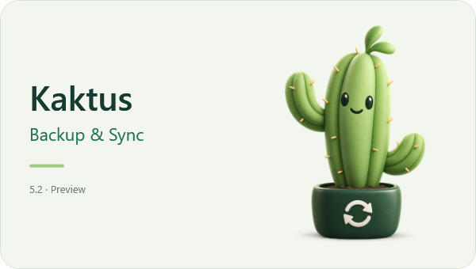

# Kaktus Backup & Sync 5.2 — руководство

[Deutsch](HANDBUCH.de.md) · [English](MANUAL.en.md) · [Русский](MANUAL.ru.md)


Выбор языка сразу обновляет меню и подсказку значка в трее. Новые уведомления
приходят на выбранном языке. Уведомления, уже показанные Windows, сохраняют
прежний текст.

Сообщения об ошибках и уже открытые подробности тоже меняют язык. Папку работающей
переносной программы нельзя включать в задачу: внутри неё изменяются рабочие данные.
Храните программу вне синхронизируемых папок. Для копии самой программы выйдите
через трей и скопируйте всю её папку в Проводнике.

## Создать задачу и синхронизировать

Нажмите **Новая задача**, введите имя, источник и существующую папку назначения.
**Выбрать** открывает диалог в уже указанной папке. **Открыть** открывает эту папку
в Проводнике. Нажмите **Проверить**: после успешной проверки задача сохраняется и
появляется план. Пустой источник тоже допустим. При ошибке подробности появляются
в области предпросмотра. Проверка не меняет ваши файлы. **Синхронизировать** выполняет
показанный план после подтверждения.

Направление всегда источник → назначение. Новые файлы добавляются. Изменения только
в источнике обновляют назначение с сохранением его предыдущей версии. Удалённый из
назначения файл снова копируется из источника. Рабочие файлы назначения программа
не удаляет; обратно в источник ничего не записывает.

## Автоматизация, пауза и трей

Включите **Проверять автоматически каждые** и выберите 1, 5, 15, 30 или 60 минут.
У сохранённых задач включение, пауза и интервал сохраняются сразу. Изменённые пути
и дополнительные настройки применяются кнопкой **Проверить**. Пока вы редактируете
задачу или просматриваете план, ручная работа имеет приоритет. Скройте окно — фоновые
задачи смогут продолжить работу.

У новой задачи по умолчанию первые пять успешных запусков требуют ручного
подтверждения. Автоматическая проверка в это время ничего не записывает. В разделе
**Защита и версии** можно посмотреть остаток, отключить защиту или снова установить
пять подтверждений. Затем нажмите **Проверить**. Ошибка и отмена не уменьшают счётчик.

**Пауза** останавливает выбранную задачу. **Пауза всех задач** приостанавливает всю
синхронизацию, включая ручную, сохраняя отдельные переключатели задач. Текущий файл
сначала завершается. Общая пауза сохраняется после перезапуска. Проверка без записи
остаётся доступной.

Крестик и сворачивание скрывают окно в трее. Двойной щелчок по значку возвращает
окно. **Закрыть программу** в меню значка завершает работу после безопасной остановки.
Стрелки вращаются во время работы; зелёная галочка означает завершённый запуск,
серый цвет — паузу, жёлтый — необходимость вмешательства. Windows может спрятать
значок под стрелкой скрытых значков. Успешные фоновые запуски проходят без всплывающих
окон; одинаковая ошибка не повторяется при каждом опросе. Запуск с Windows включается
по желанию в меню трея; окно при таком запуске скрыто.

## Флешка, конфликты и предыдущие версии

Укажите папки, откройте **Защита и версии**, нажмите **Привязать накопитель**, затем
**Проверить**. Подключение именно этого съёмного накопителя запускает задачу сразу,
если она включена, не приостановлена и пройдены безопасные подтверждения. При смене
буквы программа находит накопитель по серийному номеру тома и обновляет путь.
Источник и назначение привязываются отдельно. При отсутствии тома или одинаковом
номере у двух подключённых томов запись запрещена. После форматирования привяжите
накопитель заново. Старой привязке может понадобиться повторное назначение, если
буква изменилась до обновления программы. Программа не отключает накопитель.

Разные изменения с двух сторон и файлы, оставшиеся только в назначении, показываются
как конфликты. Выделите подходящие строки и нажмите **Взять из источника**: сначала
изменится только план. **Синхронизировать** выполнит замену с сохранением старого
назначения. Кнопка **Сравнить** показывает обе стороны, размеры, даты и хэши. **Оставить назначение**
запоминает решение до изменения одной из сторон; примените его кнопкой
**Синхронизировать**. Отмена оставляет план прежним. Невыбранные конфликты останутся без изменений. Если источника уже нет,
заменить файл из него нельзя. Обратной синхронизации нет.

Новые предыдущие версии хранятся в назначении: `.SyncVersions/<ID задачи>`.
По умолчанию сохраняются семь версий каждого файла; можно выбрать от 1 до 100.
После успешного запуска лишние старые версии этой задачи удаляются. **Предыдущие
версии** восстанавливает проверенную копию отдельным новым файлом, без перезаписи
существующего. Версии от старых сборок остаются доступны в прежнем локальном состоянии
и автоматически не удаляются. В **Истории** видны ручные и автоматические запуски.

## Установка, перенос и обновление

Windows 10/11 x64. Переносная сборка содержит нужную среду .NET и не требует
установки Python, SDK или Visual Studio. Распакуйте всю папку и откройте
`KaktusBackupSync.exe`. DLL рядом с ним нужны программе; EXE отдельно не переносите.

В ZIP уже есть `portable.flag`: задачи, язык, история и кэш сохраняются в `runtime`
рядом с EXE. Папка создаётся при использовании программы. Для переноса закройте
программу через трей и скопируйте всю папку вместе с `runtime`, DLL и `Assets`.

Прежние версии без переносного режима хранили данные в
`%LOCALAPPDATA%\AntonsBackupManager`. Чтобы сохранить старые задачи, после закрытия
обеих версий скопируйте всё содержимое той папки в новый `runtime` переносной копии.
Не смешивайте и не перезаписывайте существующие конфигурации. Подробнее в `START-HERE.txt`.

Начиная с preview.6 список задач сохраняется в формате 2 с привязками обоих концов.
Формат 1 читается автоматически. Старые версии не читают формат 2; для возврата
используйте сохранённую до обновления копию всей папки `runtime`.

Папка программы должна быть доступна для записи
и находиться вне резервируемых папок. Перед обновлением закройте программу через
трей, сохраните всё состояние вместе с `sync` и `reports`, затем замените программные
файлы в прежней папке. Личные данные не должны попадать в публичный ZIP.

Повторный запуск этой версии открывает уже работающий экземпляр. Старые сборки без
этой защиты сначала закройте. Если переносите программу, заново включите автозапуск.
Рядом с `tasks.json` хранятся три последние резервные копии настроек с датами.
При повреждении списка сохранение блокируется. Закройте программу, отдельно сохраните
повреждённый файл и восстановите проверенную резервную копию под именем `tasks.json`.
Не заменяйте настройки во время работы синхронизации.

## Как устроен код и как его проверять

**Core** — модели задач, правила путей и сравнение. Здесь нет работы с файлами или
окнами. **Infrastructure** читает и проверяет файлы, делает безопасную запись,
хранит версии, настройки, историю и кэш. **App** — WPF, модели редактора и карточек
задач, трей и взаимодействие с Windows. **MainViewModel** управляет командами и
состоянием интерфейса; **BackupWorkspace** хранит задачи и координирует файловые
операции. Код окна занимается отображением, жестами и событиями Windows.
**Tests** проверяет поведение на специально созданных вымышленных данных.

Порядок работы: проверка → неизменяемый план → подтверждение → повторная проверка →
временный файл → проверенная замена. Комментарии на простом английском объясняют
неочевидные решения.

С .NET SDK 10.0.400 в папке проекта:

```powershell
dotnet test --project tests/AntonsBackupManager.Core.Tests -c Release
dotnet build tests/AntonsBackupManager.UiCheck -c Release -o runtime/ui-check
dotnet runtime/ui-check/AntonsBackupManager.UiCheck.dll runtime/ui-audit
dotnet publish src/AntonsBackupManager.App -c Release -r win-x64 --self-contained true -o artifacts/release
```

Первое восстановление зависимостей требует доступа к пакетам. `runtime`, сборки,
личные настройки и рабочие заметки исключены из Git. Commit — сохранённый локальный
снимок кода; push — отправка на сервер. Перед публикацией отдельно проверяют автора,
историю, лицензию и состав файлов. Исходники предназначены для просмотра; открытая
лицензия на использование и распространение не предоставляется.

## Сохранность данных и ограничения

Служебные метки OneDrive поддерживаются. Файлы, доступные только в облаке, могут
потребовать скачивания средствами OneDrive. Символические ссылки, junction и
неизвестные перенаправления запрещены. Источники разных задач могут пересекаться;
назначения и пересечения источника с назначением другой задачи запрещены.

Ручная проверка читает содержимое всех файлов. Автоматическая использует известные
хэши при неизменных размере и времени изменения; по умолчанию раз в час проводится
полная проверка. Изменение содержимого с сохранением этих метаданных может обнаружиться
только при полной проверке. Перед реальным копированием или заменой содержимое всегда
проверяется заново — кэш эту проверку не заменяет.

Весь запуск не является одной транзакцией: завершённые копии остаются после ошибки
и попадают в отчёт. Заблокированный другой программой файл откладывается, остальные
обрабатываются дальше. В истории его путь выделяется жёлтым; следующая проверка
повторит попытку. Отказ в доступе и недоступный диск по-прежнему останавливают запуск.
Конфликты и отложенные файлы не уменьшают счётчик пяти успешных подтверждений.
Проверены искусственные ошибки нехватки места и недоступного устройства, отмена
внутри большого файла и принудительное завершение собственного тестового процесса.
Недописанная копия хранится в служебной `.SyncWork` и проверяется перед переносом
на окончательное место. При повторной записи программа очищает свои оставшиеся
временные файлы под исключительной блокировкой. Папка `.SyncWork` зарезервирована:
не помещайте в неё свои файлы. Старое назначение сохраняется до проверенной замены.
Это не имитация физического отключения питания: чистая Windows и аппаратное
отключение USB остаются непроверенными. Расширенные испытания сетевых путей,
масштабирования и доступности исключены из текущего этапа. Это предварительная версия.

Переименование определяется при однозначном совпадении размера и SHA-256 с одной
неизменённой прежней копией. В предпросмотре видны старый и новый пути. Синхронизация
переименует файл назначения без создания лишней версии. Одинаковые дубликаты без
однозначного соответствия и изменённое назначение автоматически не переименовываются.
Изменение только регистра имени файла поддерживается, например `Фото.jpg` → `фото.jpg`.
Регистр родительских папок автоматически не меняется. Повторное изменение имени
после проверки требует нового плана. Без надёжного соответствия остаются новые файлы
и конфликты.

## Демонстрация для практики



При обычном запуске маленький кактус плавно вырастает в горшке за три секунды,
одинаково увеличиваясь в ширину и высоту. Затем он ещё секунду остаётся на экране.
Рост сопровождается тихим шелестом листвы. Щелчок или клавиша пропускают
заставку и останавливают звук. При отключённых анимациях Windows персонаж появляется сразу, без звука.
Запуск в трее проходит без заставки. В значке кактус неподвижен, вращаются стрелки.

Подтверждённая владельцем запись шелеста включена в исходники и переносной ZIP.
При необходимости приложение работает без звука. Сведения о ресурсах:
`ASSET-NOTICES.md`. Подготовка исходников и GitHub:
[руководство на трёх языках](SOURCE-PACKAGE.md).

Создайте две временные папки вне папки программы. Поместите в источник вымышленные
файлы из `demo/Source`. Создайте задачу, проверьте и синхронизируйте. Измените текстовый
файл источника, повторите синхронизацию и восстановите прежнюю версию отдельным файлом.
Покажите общую паузу и трей. Для публичных скриншотов используйте только вымышленные
пути и имена файлов.
