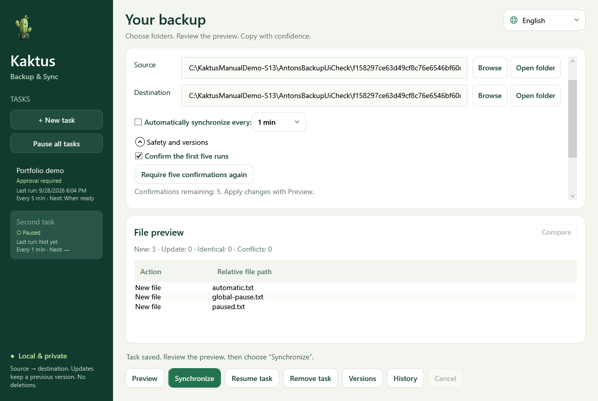

# Kaktus Backup & Sync 5.2

Preview.7 uses the approved mascot throughout the app and adds localized manual
screenshots, tray notification checks and release packaging updates.
[Architecture](ARCHITECTURE.md) · [Source package](SOURCE-PACKAGE.md).

[Deutsch](../README.md) · [English](README.en.md) · [Русский](README.ru.md)

**Windows x64 · Portable ZIP · .NET runtime included**

- [Releases and SHA-256 checksums](https://github.com/popovantondev/Kaktus-Backup-Sync/releases)
- [User manual](MANUAL.en.md) · [Feedback](https://github.com/popovantondev/Kaktus-Backup-Sync/issues)

A Windows preview for one-way backup with preview, previous versions, automatic
tasks and a tray interface. German is the default; English and Russian are available.

Extract the portable ZIP and run `KaktusBackupSync.exe`. The required .NET runtime
is included; no Python, SDK or installer is needed. Settings live in `runtime`
beside the EXE. [Portable quick start](START-HERE.txt).

Compare the downloaded ZIP's SHA-256 with the value listed for that release.
Extract the complete ZIP folder; the application does not need a separate
installation.

1. Create a task with existing source and destination folders.
2. **Preview** saves it and displays the plan.
3. **Synchronize** runs the confirmed plan.
4. Optionally enable checks every 1, 5, 15, 30 or 60 minutes.

New tasks require five successful manual confirmations. Change or reset this under
**Safety and versions**. Pause one task or all tasks. Closing hides the window;
exit from the tray menu. Updates keep previous destination versions, seven by default.
Working destination files are not automatically deleted.

The [manual](MANUAL.en.md) covers installation, portable use, updates, recovery,
architecture, build commands and limits. The [audit](RELEASE_AUDIT.md) lists
unfinished work. Tests do not replace clean-machine and physical failure testing.

Source available for viewing; [all rights reserved](../LICENSE).

## Privacy

Selected folders are processed locally; the application does not upload files.
Tasks and history are stored in the local `runtime` folder. Screenshots and bug
reports may show personal paths or file names; remove them before sharing.

## Rights

The source is public for viewing but is not open source. Individuals may download
and run an unmodified release binary for personal use. See [rights and permitted
use](../RIGHTS.md), [third-party notices](../THIRD_PARTY_NOTICES.md), and the
[license text](../LICENSE). Feedback is welcome in English, German, or Russian.
