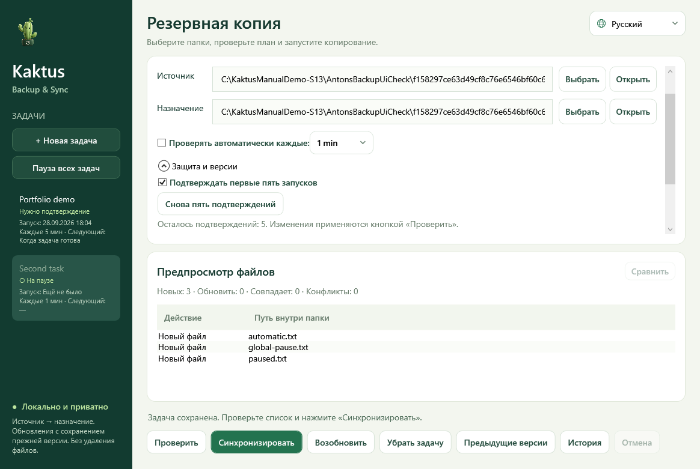

# Kaktus Backup & Sync 5.2

[Руководство пользователя](https://popovantondev.github.io/Kaktus-Backup-Sync/Guide-ru.html)

В preview.7 утверждённый маскот используется во всех значках и окнах; добавлены
скриншоты руководств на нужном языке и проверки фоновых уведомлений.
[Архитектура](ARCHITECTURE.md) · [Исходники](SOURCE-PACKAGE.md).

[Deutsch](../README.md) · [English](README.en.md) · [Русский](README.ru.md)

**Windows x64 · переносимый ZIP · .NET уже включён**

- [Релизы и SHA-256](https://github.com/popovantondev/Kaktus-Backup-Sync/releases)
- [Руководство](MANUAL.ru.md) · [Обратная связь](https://github.com/popovantondev/Kaktus-Backup-Sync/issues/new/choose)

Предварительная Windows-программа для односторонней синхронизации: просмотр плана,
предыдущие версии, автоматические задачи и трей. Немецкий язык основной;
русский и английский переключаются без перезапуска.

Распакуйте переносной ZIP и запустите `KaktusBackupSync.exe`. Нужная среда .NET
уже внутри; Python, SDK и установка не нужны. Настройки — в папке `runtime`
рядом с EXE. [Краткая инструкция по переносу](START-HERE.txt).

Сверьте SHA-256 скачанного ZIP со значением на странице релиза. Распакуйте
архив целиком: отдельная установка программе не нужна.

1. Создайте задачу и укажите существующие источник и назначение.
2. **Проверить** сохраняет задачу и показывает план.
3. **Синхронизировать** выполняет подтверждённый план.
4. По желанию включите проверки каждые 1, 5, 15, 30 или 60 минут.

Первые пять успешных запусков требуют ручного подтверждения. Защита меняется в
**Защите и версиях**. Есть отдельная и общая пауза. Крестик скрывает окно;
завершение — через меню трея. Перед обновлением сохраняется прежняя версия назначения,
по умолчанию семь версий. Рабочие файлы автоматически не удаляются.

[Руководство](MANUAL.ru.md): установка, перенос, восстановление, устройство кода и
проверки. [Сверка требований](REQUIREMENTS_STATUS.ru.md) отмечает оставшуюся работу.
Тесты не заменяют испытания на чистом компьютере и при аппаратных сбоях.

Исходники для просмотра; [все права сохранены](../LICENSE).

## Конфиденциальность

Выбранные папки обрабатываются локально, приложение не загружает файлы в сеть.
Задачи и история сохраняются в локальной папке `runtime`. На скриншотах и в
сообщениях об ошибках могут быть личные пути или имена файлов — удалите их
перед отправкой.

## Права на использование

Исходники открыты для просмотра, но это не open source. Частные лица могут
скачивать и запускать неизменённую программу из релиза для личного использования.
Подробнее: [права и условия](../RIGHTS.md), [сторонние компоненты](../THIRD_PARTY_NOTICES.md),
[текст лицензии](../LICENSE). Отзывы можно писать на русском, немецком или английском.
